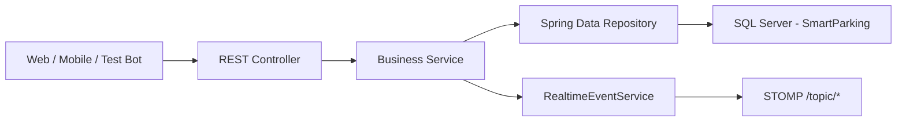
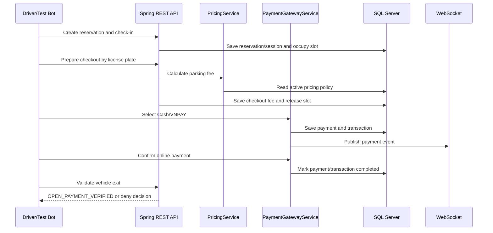

# Parking Payment System Backend

Backend Spring Boot cho hệ thống quản lý bãi đỗ xe, tập trung vào các module được giao trong `PBMS_Sheet_Full.xlsx`: reservation, pricing, parking session, payment, WebSocket và dashboard.

## 1. Trạng thái triển khai

Các chức năng hiện đã có trong repository:

- Đặt chỗ, tìm kiếm, phê duyệt và hủy reservation.
- Check-in, tạo ticket, checkout và cập nhật trạng thái parking slot.
- Tính phí theo giờ/ngày, phí mất vé và phí quá giờ.
- Thanh toán Cash và VNPAY sandbox.
- Tra cứu checkout theo biển số, theo dõi trạng thái payment và thời hạn 15 phút rời bãi.
- Xác thực payment tại cổng ra và trả quyết định mở barrier.
- Lưu, tìm kiếm và tổng hợp lịch sử giao dịch.
- Phát sự kiện realtime bằng STOMP WebSocket.
- Dashboard tổng hợp reservation, session, slot, payment, doanh thu và transaction.
- Unit test, functional test, smoke bot và concurrent load test cho payment flow.

## 2. Công nghệ và môi trường

| Thành phần | Công nghệ |
|---|---|
| Runtime | Java 17+ |
| Framework | Spring Boot 4.1.0 |
| REST API | Spring Web MVC |
| Persistence | Spring Data JPA / Hibernate |
| Database | Microsoft SQL Server hoặc MySQL / database `SmartParking` |
| Realtime | STOMP WebSocket |
| Build | Maven Wrapper |
| Test | JUnit 5, Mockito, Spring Boot Test, Java HTTP Client |

Các dependency và plugin được khai báo tại [`pom.xml`](pom.xml). SQL Server là profile mặc định; MySQL được hỗ trợ qua profile `mysql`.

## 3. Khởi động nhanh

### Điều kiện

- Java 17 trở lên.
- SQL Server lắng nghe tại `localhost:1433`.
- Database `SmartParking` đã được khởi tạo.
- Tài khoản SQL hiện tại: `sa`.

### Chạy ứng dụng

```powershell
.\mvnw.cmd test
.\mvnw.cmd spring-boot:run
```

Server mặc định chạy tại `http://localhost:8080`. Endpoint kiểm tra đơn giản là `GET /hello`, được xử lý bởi [`HelloController.java`](src/main/java/com/example/pricing_calculation/HelloController.java).

### Swagger / OpenAPI

Hệ thống dùng Springdoc OpenAPI để tự động quét toàn bộ REST controller. Sau khi ứng dụng khởi động, mở:

- Swagger UI: [http://localhost:8080/swagger-ui.html](http://localhost:8080/swagger-ui.html)
- OpenAPI JSON: [http://localhost:8080/v3/api-docs](http://localhost:8080/v3/api-docs)
- OpenAPI YAML: [http://localhost:8080/v3/api-docs.yaml](http://localhost:8080/v3/api-docs.yaml)

Test đăng ký và đăng nhập ngay trên Swagger UI:

1. Mở nhóm `Authentication`.
2. Chọn `POST /api/auth/register`, bấm **Try it out**, nhập JSON và bấm **Execute**.
3. Chọn `POST /api/auth/login`, nhập email/password đã đăng ký rồi sao chép `accessToken` từ response.
4. Bấm **Authorize** ở đầu trang, nhập access token và xác nhận.
5. Gọi `POST /api/auth/logout`; Swagger tự gửi header `Authorization: Bearer <token>`.

Metadata OpenAPI và Bearer scheme nằm tại [`OpenApiConfig.java`](src/main/java/com/example/pricing_calculation/config/OpenApiConfig.java). Chạy test tự động cho Swagger:

```powershell
.\mvnw.cmd "-Dtest=SwaggerDocumentationTest" test
```

Kết quả kiểm tra gần nhất: `2` test, `0` failure, `0` error, `BUILD SUCCESS`.

### Đóng gói

```powershell
.\mvnw.cmd -DskipTests package
java -jar target\pricing-calculation-0.0.1-SNAPSHOT.jar
```

Entry point của ứng dụng là [`PricingCalculationApplication.java`](src/main/java/com/example/pricing_calculation/PricingCalculationApplication.java).

### Chạy trên máy chỉ có MySQL

Không cần cài SSMS và không sử dụng hai file MDF/LDF. Yêu cầu MySQL 8 trở lên.

1. Khởi tạo schema bằng [`SmartParkingSystem.mysql.sql`](database/SmartParkingSystem.mysql.sql):

```powershell
cmd /c "mysql -u root -p < database\SmartParkingSystem.mysql.sql"
```

Script này tạo database nếu chưa tồn tại và tái tạo 19 bảng. Không chạy trên database `SmartParking` đang chứa dữ liệu cần giữ lại.

2. Khai báo tài khoản MySQL trong terminal:

```powershell
$env:MYSQL_USERNAME="root"
$env:MYSQL_PASSWORD="your-password"
```

3. Chạy ứng dụng với profile MySQL:

```powershell
.\mvnw.cmd spring-boot:run "-Dspring-boot.run.profiles=mysql"
```

Hoặc chạy file jar:

```powershell
java -jar target\pricing-calculation-0.0.1-SNAPSHOT.jar --spring.profiles.active=mysql
```

Cấu hình profile nằm tại [`application-mysql.properties`](src/main/resources/application-mysql.properties). Có thể ghi đè toàn bộ JDBC URL bằng biến `MYSQL_URL`.

### Tạo ZIP để gửi đi

Không zip trực tiếp MDF/LDF khi SQL Server đang chạy. Dùng script sau để tạo gói portable bên ngoài project:

```powershell
.\package-portable.ps1
```

Gói ZIP tự động loại `target`, `SmartParking.mdf` và `SmartParking_log.ldf`, nhưng vẫn chứa source, schema SQL Server và schema MySQL. Người nhận dùng MySQL chỉ cần làm theo mục phía trên.

## 4. Kiến trúc xử lý



Quy ước liên kết file:

1. `web/*Controller`: nhận HTTP request, parse DTO và trả HTTP response.
2. `service/*Service`: kiểm tra dữ liệu và thực hiện nghiệp vụ.
3. `repository/*Repository`: truy vấn entity bằng Spring Data JPA.
4. `domain/*`: ánh xạ entity tới bảng SQL Server.
5. `dto/*`: contract request/response, không lưu trực tiếp vào database.

Lỗi nghiệp vụ được ném bằng [`BadRequestException.java`](src/main/java/com/example/pricing_calculation/service/BadRequestException.java) hoặc [`ResourceNotFoundException.java`](src/main/java/com/example/pricing_calculation/service/ResourceNotFoundException.java), sau đó được chuẩn hóa thành HTTP 400/404 bởi [`ApiExceptionHandler.java`](src/main/java/com/example/pricing_calculation/web/ApiExceptionHandler.java).

## 5. Database

### Nguồn khởi tạo

- Script khởi tạo: [`database/SmartParkingSystem.sql`](database/SmartParkingSystem.sql).
- Database logic: `SmartParking` trên SQL Server Express tại `localhost:1433`.
- File dữ liệu: `D:\New folder\Parking Payment System\database\SmartParking.mdf`.
- File transaction log: `D:\New folder\Parking Payment System\database\SmartParking_log.ldf`.
- Cấu hình kết nối: [`application.properties`](src/main/resources/application.properties).

`spring.jpa.hibernate.ddl-auto=none`, vì vậy Java không tự tạo hoặc thay đổi schema. Khi database chưa tồn tại, chạy `SmartParkingSystem.sql` một lần trong SSMS 2022 trước khi khởi động backend.

Mật khẩu SQL hiện đang nằm trực tiếp trong `application.properties`. Khi triển khai thật, cần chuyển username/password sang environment variables hoặc secret manager.

### Entity và bảng được sử dụng

| Entity | Bảng | Quan hệ chính | File |
|---|---|---|---|
| `UserAccount` | `Users` | Một user có nhiều vehicle/reservation | [`UserAccount.java`](src/main/java/com/example/pricing_calculation/domain/UserAccount.java) |
| `VehicleTypeEntity` | `VehicleTypes` | Được dùng bởi vehicle, zone, pricing policy | [`VehicleTypeEntity.java`](src/main/java/com/example/pricing_calculation/domain/VehicleTypeEntity.java) |
| `Vehicle` | `Vehicles` | Thuộc user và vehicle type | [`Vehicle.java`](src/main/java/com/example/pricing_calculation/domain/Vehicle.java) |
| `Building` | `Buildings` | Có nhiều floor | [`Building.java`](src/main/java/com/example/pricing_calculation/domain/Building.java) |
| `Floor` | `Floors` | Thuộc building, có nhiều zone | [`Floor.java`](src/main/java/com/example/pricing_calculation/domain/Floor.java) |
| `Zone` | `Zones` | Thuộc floor và giới hạn theo vehicle type | [`Zone.java`](src/main/java/com/example/pricing_calculation/domain/Zone.java) |
| `ParkingSlot` | `ParkingSlots` | Thuộc zone; trạng thái `AVAILABLE`, `RESERVED`, `OCCUPIED` | [`ParkingSlot.java`](src/main/java/com/example/pricing_calculation/domain/ParkingSlot.java) |
| `PricingPolicy` | `PricingPolicies` | Chính sách phí theo vehicle type và thời gian hiệu lực | [`PricingPolicy.java`](src/main/java/com/example/pricing_calculation/domain/PricingPolicy.java) |
| `Reservation` | `Reservations` | Liên kết user, vehicle và zone | [`Reservation.java`](src/main/java/com/example/pricing_calculation/domain/Reservation.java) |
| `ParkingSession` | `ParkingSessions` | Liên kết reservation, vehicle và slot | [`ParkingSession.java`](src/main/java/com/example/pricing_calculation/domain/ParkingSession.java) |
| `Payment` | `Payments` | Thuá»™c má»™t parking session | [`Payment.java`](src/main/java/com/example/pricing_calculation/domain/Payment.java) |
| `TransactionHistory` | `Transactions` | Thuá»™c má»™t payment, lÆ°u gateway/reference/status | [`TransactionHistory.java`](src/main/java/com/example/pricing_calculation/domain/TransactionHistory.java) |

Script SQL còn tạo `Gates`, `Violations`, `IncidentReports`, `Feedbacks`, `Notifications`, `AuditLogs` và `LicensePlateScans`. Repository hiện chưa có entity/API cho các bảng này.

## 6. Chức năng hệ thống

### Authentication API (không cần frontend)

Backend cung cấp đầy đủ API đăng ký, đăng nhập và đăng xuất. Có thể gọi trực tiếp bằng Postman, `curl` hoặc bất kỳ ứng dụng web/mobile nào; dự án không phụ thuộc vào mã nguồn frontend.

| API | Chức năng | Kết quả chính |
|---|---|---|
| `POST /api/auth/register` | Tạo tài khoản `CUSTOMER` đang hoạt động | HTTP 201 và thông tin tài khoản, không trả mật khẩu |
| `POST /api/auth/login` | Kiểm tra email/mật khẩu | Bearer access token có hiệu lực 8 giờ |
| `POST /api/auth/logout` | Thu hồi access token hiện tại | Xóa phiên đăng nhập phía backend |

Ví dụ đăng ký:

```powershell
$body = @{
    fullName = "Nguyen Van A"
    email = "customer@example.com"
    phone = "0901234567"
    password = "safe-password-123"
} | ConvertTo-Json

Invoke-RestMethod -Method Post `
    -Uri "http://localhost:8080/api/auth/register" `
    -ContentType "application/json" `
    -Body $body
```

Ví dụ đăng nhập và đăng xuất:

```powershell
$loginBody = @{
    email = "customer@example.com"
    password = "safe-password-123"
} | ConvertTo-Json

$login = Invoke-RestMethod -Method Post `
    -Uri "http://localhost:8080/api/auth/login" `
    -ContentType "application/json" `
    -Body $loginBody

Invoke-RestMethod -Method Post `
    -Uri "http://localhost:8080/api/auth/logout" `
    -Headers @{ Authorization = "Bearer $($login.accessToken)" }
```

Email được chuẩn hóa về chữ thường; password dài 8–128 ký tự và chỉ được lưu dưới dạng PBKDF2-SHA256 kèm salt. Backend tự gán `status=ACTIVE` và `role=CUSTOMER`, nên client không thể tự cấp quyền cho mình. Phiên đăng nhập hiện được giữ trong bộ nhớ và sẽ bị xóa khi ứng dụng khởi động lại.

### 6.1 Reservation

| API | Chức năng |
|---|---|
| `POST /api/reservations` | Tạo reservation và tự đặt trạng thái `APPROVED` |
| `GET /api/reservations` | Lọc theo user, vehicle, zone, status và khoảng thời gian |
| `GET /api/reservations/{id}` | Xem chi tiết |
| `PATCH /api/reservations/{id}/approve` | Phê duyệt |
| `PATCH /api/reservations/{id}/cancel` | Hủy |

File xử lý và liên kết:

- [`ReservationController.java`](src/main/java/com/example/pricing_calculation/web/ReservationController.java) định nghĩa endpoint.
- [`ReservationService.java`](src/main/java/com/example/pricing_calculation/service/ReservationService.java) kiểm tra user/vehicle/zone, quyền sở hữu vehicle và sức chứa zone.
- [`ReservationRepository.java`](src/main/java/com/example/pricing_calculation/repository/ReservationRepository.java) đếm reservation trùng thời gian.
- `UserAccountRepository`, `VehicleRepository`, `ZoneRepository` cung cấp dữ liệu tham chiếu.
- [`ParkingSlotRepository.java`](src/main/java/com/example/pricing_calculation/repository/ParkingSlotRepository.java) cung cấp tổng số slot để kiểm tra capacity.
- [`Reservation.java`](src/main/java/com/example/pricing_calculation/domain/Reservation.java) ánh xạ bảng `Reservations`.
- `ReservationCreateRequest`, `ReservationResponse`, `PageResponse` là DTO request/response.
- `RealtimeEventService` phát sự kiện reservation tới `/topic/reservations`.

### 6.2 Pricing calculation

| API | Chức năng |
|---|---|
| `GET /api/pricing/estimate` | Ước tính phí theo vehicle type, entry/exit time, mất vé và số phút quá giờ |

Tham số: `vehicleTypeId`, `entryTime`, `exitTime`, `lostTicket`, `overtimeMinutes`.

File xử lý và liên kết:

- [`PricingController.java`](src/main/java/com/example/pricing_calculation/web/PricingController.java) nhận query parameter.
- [`PricingService.java`](src/main/java/com/example/pricing_calculation/service/PricingService.java) chọn policy còn hiệu lực và tính phí.
- [`PricingPolicyRepository.java`](src/main/java/com/example/pricing_calculation/repository/PricingPolicyRepository.java) tìm policy `ACTIVE` theo thời điểm entry.
- [`VehicleTypeRepository.java`](src/main/java/com/example/pricing_calculation/repository/VehicleTypeRepository.java) cung cấp default hourly fee khi không có policy.
- [`PricingPolicy.java`](src/main/java/com/example/pricing_calculation/domain/PricingPolicy.java) và `VehicleTypeEntity` ánh xạ dữ liệu giá.
- [`PricingQuoteResponse.java`](src/main/java/com/example/pricing_calculation/dto/PricingQuoteResponse.java) trả chi tiết từng thành phần phí và currency `VND`.

Quy tắc chính:

- Thời gian được làm tròn lên theo giờ, tối thiểu một giờ.
- Từ 24 giờ trở lên dùng `dailyRate`, sau đó cộng số giờ dư theo `hourlyRate`.
- `lostTicket=true` cá»™ng `lostTicketFee`.
- Overtime làm tròn lên theo giờ rồi nhân `overtimeFee`.

### 6.3 Parking session

| API | Chức năng |
|---|---|
| `POST /api/parking-sessions/check-in` | Tạo session/ticket và chuyển slot sang `OCCUPIED` |
| `GET /api/parking-sessions/{id}` | Xem session |
| `POST /api/parking-sessions/{id}/checkout` | Tính phí, chuyển session sang `CHECKED_OUT` và trả slot về `AVAILABLE` |

File xử lý và liên kết:

- [`ParkingSessionController.java`](src/main/java/com/example/pricing_calculation/web/ParkingSessionController.java) định nghĩa endpoint.
- [`ParkingSessionService.java`](src/main/java/com/example/pricing_calculation/service/ParkingSessionService.java) xác thực vehicle/slot/reservation, tạo ticket và gọi `PricingService` khi checkout.
- `ParkingSessionRepository`, `ReservationRepository`, `VehicleRepository`, `ParkingSlotRepository` đọc và ghi dữ liệu.
- [`ParkingSession.java`](src/main/java/com/example/pricing_calculation/domain/ParkingSession.java) liên kết `Reservation`, `Vehicle`, `ParkingSlot`.
- `SessionCheckInRequest`, `SessionCheckoutRequest`, `ParkingSessionResponse` là DTO.
- Sự kiện session/slot được phát tới `/topic/parking-sessions` và `/topic/parking-slots`.

### 6.4 Payment cơ bản

| API | Chức năng |
|---|---|
| `POST /api/payments` | Tạo payment trực tiếp cho một session |
| `GET /api/payments/{id}` | Xem payment |
| `PATCH /api/payments/{id}/status` | Cập nhật trạng thái và có thể tạo transaction gateway |

File xử lý và liên kết:

- [`PaymentController.java`](src/main/java/com/example/pricing_calculation/web/PaymentController.java) nhận request.
- [`PaymentService.java`](src/main/java/com/example/pricing_calculation/service/PaymentService.java) lấy `totalFee` từ session khi request không truyền amount, lưu payment và tạo transaction nếu có gateway/reference.
- `PaymentRepository`, `ParkingSessionRepository`, `TransactionHistoryRepository` thực hiện persistence.
- [`Payment.java`](src/main/java/com/example/pricing_calculation/domain/Payment.java) ánh xạ `Payments`; `TransactionHistory` ánh xạ `Transactions`.
- `PaymentCreateRequest`, `PaymentStatusUpdateRequest`, `PaymentResponse` là DTO.
- Payment event được phát tới `/topic/payments`.

### 6.5 Payment gateway

| API | Chức năng |
|---|---|
| `POST /api/payment-gateways/cash` | Tạo payment `COMPLETED` ngay |
| `POST /api/payment-gateways/vnpay` | Create a `PENDING` payment and signed VNPay Sandbox URL; `qrContent` contains the same URL |
| `GET /api/payment-gateways/vnpay/return` | Verify VNPay return signature, amount and transaction before updating payment |
| `GET /api/payment-gateways/vnpay/ipn` | Verified VNPay IPN endpoint returning `RspCode` and `Message` |

File xử lý và liên kết:

- [`PaymentGatewayController.java`](src/main/java/com/example/pricing_calculation/web/PaymentGatewayController.java) cung cấp API gateway.
- [`PaymentGatewayService.java`](src/main/java/com/example/pricing_calculation/service/PaymentGatewayService.java) sinh reference code, gọi `PaymentService`, đồng bộ status của `Payments` và `Transactions`, đồng thời tạo `exitDeadline = paymentTime + 15 phút`.
- `PaymentRepository` và `TransactionHistoryRepository` tra cứu/cập nhật payment cùng transaction.
- `PaymentGatewayRequest`, `PaymentGatewayConfirmRequest`, `PaymentGatewayResponse` là DTO.

VNPay Sandbox uses merchant configuration from environment variables, HMAC-SHA512 request signing and verified Return/IPN callbacks.

### 6.6 Payment checkout và barrier

| API | Chức năng |
|---|---|
| `POST /api/payment-checkout/prepare` | Tìm session mới nhất theo biển số; nếu đang `ACTIVE` thì checkout và tính phí |
| `GET /api/payment-checkout/sessions/{sessionId}/status` | Trả payment status, `paid`, `paidAt`, `exitDeadline` và cửa sổ 15 phút |
| `POST /api/payment-checkout/validate-exit` | Kiểm tra xe đã trả tiền và còn trong thời hạn để quyết định mở barrier |

File xử lý và liên kết:

- [`PaymentCheckoutController.java`](src/main/java/com/example/pricing_calculation/web/PaymentCheckoutController.java) cung cấp ba endpoint.
- [`PaymentCheckoutService.java`](src/main/java/com/example/pricing_calculation/service/PaymentCheckoutService.java) tìm session bằng `ParkingSessionRepository`, gọi `ParkingSessionService` để tính phí và dùng `PaymentRepository` để xác minh payment.
- `PaymentCheckoutPrepareRequest`, `PaymentCheckoutResponse`, `PaymentExitValidationRequest`, `PaymentExitValidationResponse` là DTO.
- Kết quả barrier là `OPEN_PAYMENT_VERIFIED`, `DENY_PAYMENT_REQUIRED` hoặc `DENY_EXIT_WINDOW_EXPIRED`.
- Quyết định được phát realtime tới `/topic/parking-sessions`.

Backend chỉ trả quyết định `openBarrier`; chưa tích hợp thiết bị/barrier API thật.

### 6.7 Transaction history

| API | Chức năng |
|---|---|
| `GET /api/transaction-history` | Tìm kiếm có phân trang và filter |
| `GET /api/transaction-history/summary` | Tổng hợp số lượng, amount và trạng thái |
| `GET /api/transaction-history/recent` | Lấy transaction gần nhất |
| `GET /api/transaction-history/code/{code}` | Tìm theo reference code |
| `GET /api/transaction-history/{id}` | Tìm theo ID |
| `POST /api/transaction-history` | Tạo transaction cho payment có sẵn |
| `PUT /api/transaction-history/{id}` | Cập nhật transaction |
| `PATCH /api/transaction-history/{id}/status` | Đổi trạng thái |
| `DELETE /api/transaction-history/{id}` | Xóa transaction |

Filter hỗ trợ `keyword`, `type`, `status`, `paymentMethod`, `licensePlate`, `reservationCode`, thời gian, khoảng amount, paging và sorting.

- [`TransactionHistoryController.java`](src/main/java/com/example/pricing_calculation/web/TransactionHistoryController.java) định nghĩa API.
- [`TransactionHistoryService.java`](src/main/java/com/example/pricing_calculation/service/TransactionHistoryService.java) dựng JPA specification và summary.
- [`TransactionHistoryRepository.java`](src/main/java/com/example/pricing_calculation/repository/TransactionHistoryRepository.java) hỗ trợ CRUD, specification, reference lookup và recent query.
- `TransactionHistory` liên kết tới `Payment`, sau đó lần theo `ParkingSession`, `Vehicle`, `Reservation` và `UserAccount` để dựng response.
- `TransactionStatus`, `TransactionType`, `PaymentMethod` định nghĩa các enum hỗ trợ filter.

### 6.8 Realtime WebSocket

- STOMP endpoint: `/ws`.
- Broker prefix: `/topic`.
- Application prefix: `/app`.
- Topic hiện dùng: `/topic/reservations`, `/topic/parking-sessions`, `/topic/parking-slots`, `/topic/payments`.

[`WebSocketConfig.java`](src/main/java/com/example/pricing_calculation/config/WebSocketConfig.java) cấu hình broker; [`RealtimeEventService.java`](src/main/java/com/example/pricing_calculation/service/RealtimeEventService.java) đóng gói payload bằng `WebSocketEvent` và phát từ các service nghiệp vụ.

`setAllowedOriginPatterns("*")` phù hợp môi trường phát triển nhưng cần giới hạn domain khi triển khai production.

### 6.9 Dashboard

| API | Chức năng |
|---|---|
| `GET /api/dashboard/overview` | Trả số liệu tổng quan hiện tại |

Response gồm tổng/pending/approved reservations, active sessions, available/occupied/reserved slots, pending/completed payments, doanh thu hôm nay và tổng transactions.

- [`DashboardController.java`](src/main/java/com/example/pricing_calculation/web/DashboardController.java) cung cấp endpoint.
- [`DashboardService.java`](src/main/java/com/example/pricing_calculation/service/DashboardService.java) tổng hợp từ `ReservationRepository`, `ParkingSessionRepository`, `ParkingSlotRepository`, `PaymentRepository` và `TransactionHistoryRepository`.
- [`DashboardOverviewResponse.java`](src/main/java/com/example/pricing_calculation/dto/DashboardOverviewResponse.java) là contract response.

## 7. Authentication bot testing

[`AuthFlowBot.java`](src/test/java/com/example/pricing_calculation/authtest/AuthFlowBot.java) dùng Java HTTP Client gọi REST API thật trên một cổng ngẫu nhiên. Bot tự tạo email duy nhất và kiểm tra toàn bộ chuỗi sau:

| Bước | API | Kết quả bắt buộc |
|---|---|---|
| Đăng ký | `POST /api/auth/register` | HTTP 201, `ACTIVE`, role `CUSTOMER`, response không lộ password |
| Đăng nhập sai | `POST /api/auth/login` | HTTP 401 và không cấp token |
| Đăng nhập đúng | `POST /api/auth/login` | HTTP 200, trả Bearer token và thời gian hết hạn |
| Đăng xuất | `POST /api/auth/logout` | HTTP 200, token bị thu hồi |
| Dùng lại token | `POST /api/auth/logout` | HTTP 401, chứng minh token cũ không còn hiệu lực |

[`AuthFlowBotTest.java`](src/test/java/com/example/pricing_calculation/authtest/AuthFlowBotTest.java) khởi động Spring Boot, controller, service và JPA với database H2 in-memory riêng. Test không cần frontend, không cần SQL Server và tự xóa tài khoản bot sau khi hoàn tất.

Chạy riêng bot auth:

```powershell
.\mvnw.cmd "-Dtest=AuthFlowBotTest" test
```

Log chạy thực tế gần nhất ngày `2026-06-18`:

```text
[auth-bot] result=PASS durationMs=1384 register=201 invalidLogin=401 login=200 logout=200 reusedToken=401
Tests run: 1, Failures: 0, Errors: 0, Skipped: 0
BUILD SUCCESS
```

Toàn bộ test suite sau khi thêm bot và Swagger: `24` test, `0` failure, `0` error, `2` payment smoke/load test được skip theo cấu hình mặc định; kết quả `BUILD SUCCESS`.

Các unit test auth bổ sung nằm tại [`AuthServiceTest.java`](src/test/java/com/example/pricing_calculation/service/AuthServiceTest.java), kiểm tra chuẩn hóa dữ liệu, hash mật khẩu, email trùng, credential sai và thu hồi token.

## 8. Payment testing

Mục này hợp nhất nội dung trước đây của `PAYMENT_TESTING.md`. Phạm vi test là backend payment; website chỉ được dùng làm tài liệu xác định luồng, không kiểm thử UI.

### Functional test cases

| ID | Tác vụ | Test method | Kết quả mong đợi |
|---|---|---|---|
| PAY-001 | Nhập biển số | `prepareByPlateChecksOutActiveSessionAndReturnsCalculatedFee` | Tìm session và chuyển `ACTIVE` sang `CHECKED_OUT` |
| PAY-002 | Tính phí giờ/mất vé/overtime | `calculatesHourlyLostTicketAndOvertimeFees` | Tính đúng parking fee và penalty |
| PAY-003 | Tính phí ngày | `appliesDailyRateThenRemainingHourlyRate` | Dùng daily rate và giờ còn lại |
| PAY-004 | Cash | `cashCompletesImmediatelyAndReturnsExitDeadline` | `COMPLETED` và có deadline 15 phút |
| PAY-006 | VNPAY | `vnpayCreatesPendingPaymentUrlAndQrContent` | `PENDING`, URL và QR content |
| PAY-007 | Callback thành công | `successfulCallbackCompletesPaymentAndStartsFifteenMinuteWindow` | Payment/transaction thành `COMPLETED` |
| PAY-008 | Callback sai gateway | `callbackRejectsReferenceFromAnotherGateway` | Từ chối cập nhật |
| PAY-009 | Trạng thái payment | `completedPaymentStatusIncludesFifteenMinuteDeadline` | `paid=true`, deadline và window 15 phút |
| PAY-010 | Xe ra đúng hạn | `exitValidationOpensBarrierInsidePaymentWindow` | `openBarrier=true` |
| PAY-011 | Xe ra quá hạn | `exitValidationRejectsExpiredPaymentWindow` | `DENY_EXIT_WINDOW_EXPIRED` |
| PAY-012 | Xe chưa trả tiền | `exitValidationRejectsUnpaidVehicle` | `DENY_PAYMENT_REQUIRED` |

Các unit/functional test nằm tại:

- [`PricingServiceTest.java`](src/test/java/com/example/pricing_calculation/service/PricingServiceTest.java).
- [`PaymentGatewayServiceTest.java`](src/test/java/com/example/pricing_calculation/service/PaymentGatewayServiceTest.java).
- [`PaymentCheckoutServiceTest.java`](src/test/java/com/example/pricing_calculation/service/PaymentCheckoutServiceTest.java).
- [`PricingCalculationApplicationTests.java`](src/test/java/com/example/pricing_calculation/PricingCalculationApplicationTests.java).

Chạy suite mặc định:

```powershell
.\mvnw.cmd test
```

### Smoke bot

[`PaymentFlowBot.java`](src/test/java/com/example/pricing_calculation/paymenttest/PaymentFlowBot.java) dùng Java HTTP Client gọi API thật qua controller/service/JPA/SQL Server. Một bot thực hiện reservation, check-in, tính phí, payment, callback, kiểm tra deadline và validate barrier.

[`PaymentFlowSmokeTest.java`](src/test/java/com/example/pricing_calculation/paymenttest/PaymentFlowSmokeTest.java) chạy tuần tự hai luồng `CASH`, `VNPAY`.

```powershell
.\mvnw.cmd "-Dpayment.smoke=true" "-Dtest=PaymentFlowSmokeTest" test
```

### Load test

[`PaymentLoadTest.java`](src/test/java/com/example/pricing_calculation/paymenttest/PaymentLoadTest.java) dùng `ExecutorService` và `CountDownLatch` để chạy bot đồng thời. Số user tối đa được giới hạn ở 200.

```powershell
.\mvnw.cmd "-Dpayment.load=true" "-Dpayment.load.users=30" "-Dpayment.load.concurrency=10" "-Dpayment.load.p95-ms=15000" "-Dtest=PaymentLoadTest" test
```

Kết quả kiểm tra gần nhất trên máy local:

```text
[payment-load] users=30 concurrency=10 successful=30 totalMs=1047 p95Ms=796 flowsPerSecond=28.65
```

[`PaymentTestDataFactory.java`](src/test/java/com/example/pricing_calculation/paymenttest/PaymentTestDataFactory.java) tạo dữ liệu marker riêng trong SQL Server và xóa `Transactions`, `Payments`, `ParkingSessions`, `Reservations` cùng toàn bộ dữ liệu nền sau mỗi test. Smoke/load test đều assert không còn marker.

## 9. Cấu trúc thư mục

```text
src/main/java/com/example/pricing_calculation/
|-- config/       WebSocket configuration
|-- domain/       JPA entities và enums
|-- dto/          Request/response contracts
|-- repository/   Spring Data JPA access
|-- service/      Business logic
`-- web/          REST controllers và exception handler

src/test/java/com/example/pricing_calculation/
|-- authtest/     HTTP bot cho register, login và logout
|-- service/      Unit/functional tests
`-- paymenttest/  HTTP bot, smoke test, load test và test data factory
```

## 10. Luồng payment hoàn chỉnh




